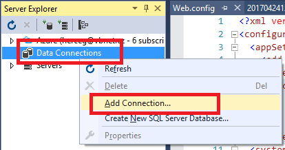

## 2 Databáze

Abychom se nezdržovali vytvářením databáze, připravili jsme již hotový Entity Framework Code First model a funkci, která databázi naplní vzorovými daty.

### 2.1 Založení databázové vrstvy

> Přidejte do solution projekt typu *Class Library* s názvem `DotvvmBlog.DAL`.

Tento projekt bude obsahovat databázový model vytvořený pomocí knihovny Entity Framework Code First.

Abychom nemuseli vymýšlet, jak v databázi ukládat uživatele, použijeme též knihovnu ASP.NET Identity, která v databázi vytvoří několik tabulek pro ukládání uživatelský účtů a rolí. Zároveň ukládá hesla uživatelů tak, aby to bylo bezpečné.

> Nakopírujte do tohoto projektu následující soubory a složky ze [vzorového projektu](https://github.com/rigatni/dotvvm-hands-on-lab), který najdete ve složce `sample\DotvvmBlog.DAL`:
> * `Migrations`
> * `Model`
> * `BlogDbContext.cs`

### 2.2 Instalace balíčků

> V okně *Package Manager Console* vyberte jako *Default project* projekt `DotvvmBlog.DAL`. 

> Spusťte příkaz `Install-Package Microsoft.AspNet.Identity.EntityFramework`.


Vzhledem k tomu, že tento balíček závisí na Entity Frameworku, Nuget automaticky doinstaluje i Entity Framework.

### 2.3 Konfigurace SQL Server LocalDB

Nejprve se ujistíme, že SQL Server LocalDB je nastartován. 

> V menu Start dejte vyhledat `SQLLocalDB` a spusťte jej. 

Mělo by se objevit konzolové okno a hned zase zmizí. Zároveň by se tím měla nastartovat instance `(localdb)\MSSQLLocalDB`, na níž rozběheneme naši databázi.

Entity Framework model je nastaven tak, aby použil connection string s názvem `DB` z konfiguračního souboru.

> Otevřete soubor `web.config` v DotVVM projektu.

> Přidejte do něj následující sekci:

```
  <connectionStrings>
    <add name="DB" 
         connectionString="Data Source=(localdb)\MSSQLLocalDB; Initial Catalog=dotvvmblog; Integrated Security=true"
         providerName="System.Data.SqlClient"/>
  </connectionStrings>
```

> Ujistěte se, že DotVVM projekt je v okně *Solution Explorer* tučně (že se jedná o startup projekt), Pokud ne, pravým tlačítkem na něj klikněte a vyberte volbu *Set as Startup Project*.


> V okně *Package Manager Console* nyní spusťte příkaz `Update-Database`. 

Tento příkaz by měl založit databázi včetně vzorových dat pomocí connection stringu ze startup projektu.


### 2.4 Připojení k databázi

Abychom ověřili, že databáze byla vytvořena, zkusíme se k ní připojit.

> V menu *View* vyberte položku *Server Explorer*. 

> Pravým tlačítkem klikněte na *Data connections* a vyberte možnost *Add Connection*.



> V okně pro výběr typu databáze vyberte *Microsoft SQL Server*.


> V následujícím okně zadejte jako server `(localdb)\MSSQLLocalDB` a jako databázi vyberte `dotvvmblog`.


> Rozbalte databázi a složku *Tables* a na první tabulce vyberte v kontextovém menu volbu *Show Table Data*.


Měl by se zobrazit seznam článků.

[> Další kapitola](03.md)