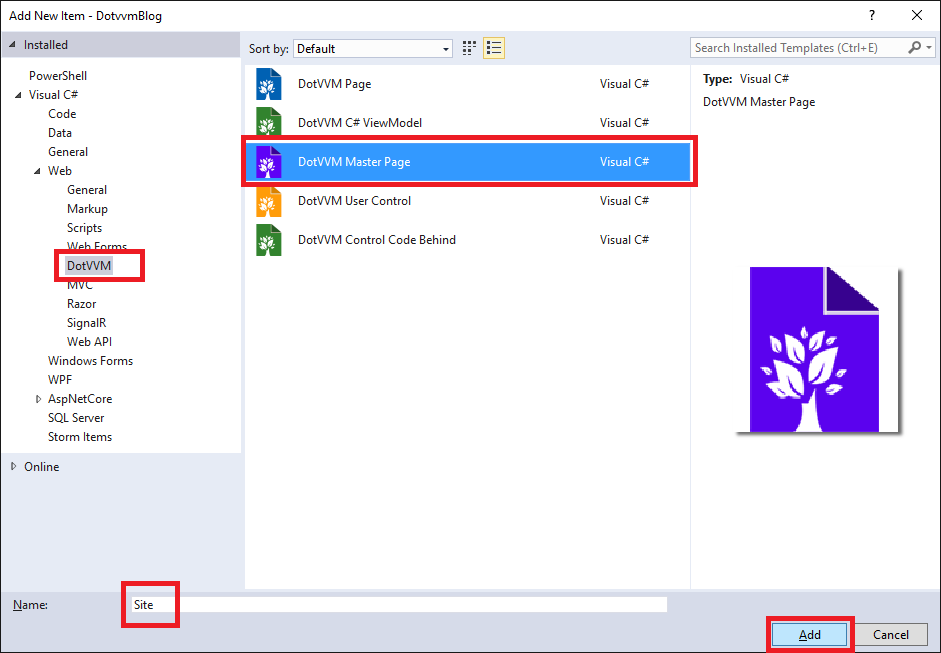

## 4 Úvodní stránka

Nyní máme připraveno vše pro to, abychom mohli začít pracovat na webové aplikaci.

### 4.1 Přidání Bootstrapu

Abychom nemuseli vymýšlet složitě vzhled webu, můžeme použít populární CSS framework [Bootstrap](https://getbootstrap.com).

> V *Package Manager Console* vyberte jako default project `DotvvmBlog` a spusťte `Install-Package bootstrap`.

V projektu se nám objevilo několik složek:

* `Content` obsahuje CSS styly. 

* `fonts` obsahuje font _glyphicons_, který se používá pro ikony. 

* `Scripts` obsahuje JavaScriptovou část Bootstrapu, a dále knihovnu jQuery, kterou bootstrap vyžaduje.

### 4.2 Použití Bootstrapu

V DotVVM máme dvě možnosti, jak pracovat se skripty a styly.

První možnost je úplně stejná jako ve kterékoliv jiné technologii, a sice ruční přidání elementů `<script src=...>` a `<link rel=stylesheet ...>` do stránky.

Druhá možnost je využít resource systém DotVVM, který umožňuje pokročilejší funkce, jako např. načtení skriptu z CDN s možností zvolit alternativní zdroj pro případ, že by CDN byla nedostupná. Dále umožňuje například bundling. 

Resource systém DotVVM je vhodné použít v případě, že skripty nebo styly potřebujete načíst jen na určitých stránkách, nebo je zahrnout jako součást nějaké vlastní komponenty.

Přestože nám by zřejmě stačilo nalinkování CSS souboru bootstrapu do hlavičky v HTML pomocí elementu `<link rel=stylesheet ...>`, ukážeme si, jak využít resource systém v DotVVM.

> Otevřete soubor `DotvvmStartup.cs` a do metody `ConfigureResources` přidejte následující kód:

```
    config.Resources.Register("bootstrap", new StylesheetResource()
    {
        Location = new UrlResourceLocation("/Content/bootstrap.min.css"),
        Dependencies = new[] { "bootstrap-js" }
    });
    config.Resources.Register("bootstrap-js", new ScriptResource()
    {
        Location = new UrlResourceLocation("/Scripts/bootstrap.min.js"),
        Dependencies = new[] { "jquery" }
    });
```

Tím jsme do aplikace zaregistrovali resource s názvem `bootstrap` a řekli DotVVM, že to je CSS styl (`StylesheetResource`) a kde leží. 

Zároveň jsme řekli, že resource `bootstrap` závisí na resource s názvem `bootstrap-js`, což je skript (`ScriptResource`), který závisí na `jquery`.
DotVVM již zahrnuje resource `jquery` ve verzi 2.1.1, což Bootstrapu stačí.

Kdekoliv v aplikaci nyní můžeme říci, že chceme resource `bootstrap` (např. tím, že do stránky přidáme komponentu `<dot:RequiredResource Name="bootstrap" />`, nebo z kódu), a DotVVM nám načte jednak CSS, jednak skript, a zároveň se ujistí, že je ve stránce načteno jQuery (DotVVM jej totiž přidává jen v debug módu, aby fungovaly jeho diagnostické doplňky, ne v produkčním prostředí).

> Přidejte do této metody ještě následující kód:

```
    config.Resources.Register("site", new StylesheetResource()
    {
        Location = new UrlResourceLocation("/Content/site.css"),
        Dependencies = new[] { "bootstrap" }
    });
```

Tímto říkáme, že přidáváme ještě styl `Content/site.css`, který závisí na Bootstrapu. Některé CSS třídy Bootstrapu totiž budeme chtít přepsat, a potřebujeme, aby se tento náš soubor přidal do stránky až za Bootstrapem.

> Zkopírujte soubor `site.css` ze [vzorového projektu](https://github.com/riganti/dotvvm-hands-on-lab) ze složky `sample\DotvvmBlog\Content` do složky `Content`.

V aplikaci si tedy vyžádáme resource s názvem `site`.

### 4.3 Přidání Master Page

Když se podíváte do stránky `Default.dothtml`, vidíme v ní kompletní strukturu HTML, sekci `head`, `body` atd. 
V reálné aplikaci mají většinou všechny stránky společné záhlaví a zápatí a liší se jen obsah uvnitř.

DotVVM tuto situaci řeší pomocí tzv. _Master Pages_.

> Smažte tedy stránku `Default.dothtml` a viewmodel `DefaultViewModel`.

> Klikněte pravým tlačítkem na složku `Views` a vyberte z kontextového menu volbu *Add / New Item*.


> V dialogovém okně vyberte možnost *DotVVM Master Page* ze sekce *DotVVM*. Pojmenujte ji `Site`.



> Potvrďte následující dialogové okno, které se ptá, jestli pro master page chceme zároveň vytvořit viewmodel.


Visual Studio by mělo kromě souboru `Views\Site.dotmaster` vytvořit i soubor `ViewModels\SiteViewModel.cs`. 


### 4.4 Základní šablona webu

> Otevřete soubor `Site.dotmaster` a nahraďte jeho kód za tento:

```
@viewModel DotvvmBlog.ViewModels.SiteViewModel, DotvvmBlog

<!DOCTYPE html>

<html lang="en" xmlns="http://www.w3.org/1999/xhtml">
<head>
    <meta charset="utf-8" />
    <title>{{value: PageTitle}}</title>
</head>
<body>

    <div class="container-fluid part-login">
        <!-- admin section link, login button -->
    </div>

    <div class="container part-content">

        <dot:ContentPlaceHolder ID="MainContent" />

    </div>

    <div class="container-fluid part-footer">
        Powered by <a href="https://www.dotvvm.com" target="_blank">DotVVM</a>
    </div>

    <dot:RequiredResource Name="site" />

</body>
</html>
```

Udělali jsme několik věcí:

1. Do elementu `title` jsme přidali data-binding na vlastnost `PageTitle` z viewmodelu. Kvůli optimalizaci pro vyhledávače je vhodné mít na každé stránce relevantní titulek.

2. Do stránky jsme přidali tři sekce - horní menu, hlavní obsah a patičku.

3. Na konci stránky jsme si vyžádali resource `site`, který jsme v předchozí části nastavili. DotVVM do stránky přidá příslušné `script` a `link` elementy ve správném pořadí. Na tom, na jaké konkrétní místo komponentu `dot:RequiredResource` dáte, nezáleží. DotVVM přidává styly do sekce `head` a skripty na konec sekce `body`. Ustálila se konvence dávat ji na konec sekce `body`.

Všimněte si, že prostřední sekce obsahuje komponentu `dot:ContentPlaceHolder`. Tato komponenta označuje místo, kam bude dosazen obsah konkrétní stránky.

> Otevřete soubor `ViewModels\SiteViewModel.cs`.

`SiteViewModel` je viewmodel pro master page. Viewmodel každé stránky, která bude používat tuto master page, musí dědit ze `SiteViewModel`. 

> Udělejte třídu `SiteViewModel` abstraktní a přidejte do této třídy abstraktní property `PageTitle` typu `string`:

```
    public abstract class SiteViewModel : DotvvmViewModelBase
    {

        public abstract string PageTitle { get; }

    }
```

Všechny stránky, které budou používat tuto master page, budou muset naimplementovat vlastnost `PageTitle`, aby bylo zajištěno, že každá stránka má svůj titulek.

### 4.5 Úvodní stránka

Konečně můžeme vytvořit úvodní stránku.

> Klikněte pravým tlačítkem na složku `Views` a vyberte *Add / New Item*.

> Vyberte šablonu *DotVVM Page* a pojmenujte ji `Default`:


> V následujícím okně zaškrtněte volbu *Embed in Master Page* a vyberte masterpage `Site.dotmaster`:


Visual Studio nám vytvoří soubor `Views\Default.dothtml` a viewmodel `ViewModels\DefaultViewModel.cs`.

Všimněte si, že soubor `Default.dothtml` obsahuje nahoře direktivu `@masterPage Views/Site.dotmaster`. Ta říká DotVVM, že tato stránka má být vložena do příslušné master page.

Stránka samotná neobsahuje elementy `head` a `body`, nýbrž komponentu `dot:Content`. Obsah, který umístíte do této komponenty, se včlení do `ContentPlaceHolder`u v master page. 

Komponent `Content` a `ContentPlaceHolder` může být ve stránce i v master page více - `Content` se vlastností `ContentPlaceHolderID` odkazuje na příslušný `ContentPlaceHolder`. Pokud byste tedy v každé stránce chtěli ovlivnit to, co je v master page v menu, nebo třeba v patičce, můžete přidat druhý `ContentPlaceHolder`. 

> Do `Default.dothtml` přidejte dovnitř komponenty `dot:Content` následující obsah:

```
    <div class="jumbotron">
        <h1>DotVVM Blog</h1>
        <h2>Recent Articles</h2>
    </div>
```

> Nyní otevřete soubor `ViewModels\DefaultViewModel.cs` a naimplementujte abstraktní vlastnost `PageTitle`:

```
    public override string PageTitle => "DotVVM Blog";
```

> Spusťte aplikaci pomocí klávesy *F5*. Měla by se ukázat stránka s horním panelem a zápatím dfinované v master page, a box s nápisy *DotVVM Blog* a *Recent Articles*, které jsme přidali do `Default.dothtml`.

[> Další kapitola](05.md)