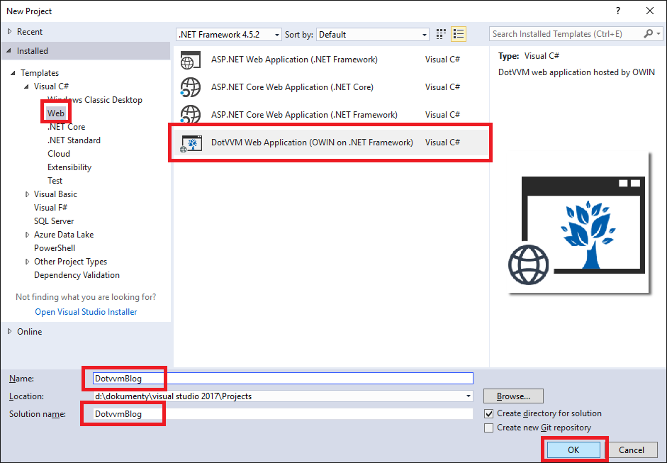

## 1 Create Project

In this Hands on lab we are going to create a simple blog website using the [DotVVM](https://www.dotvvm.com) framework.

We will use the SQL Server Local DB and Entity Framework to access the SQL database. We are also going to use Bootstrap, a popular CSS framework.

### Prerequisities

* To understand *DotVVM*, you need a basic knowledge of *C#*, *HTML* and *CSS*.
* You will need *Visual Studio 2015* or *Visual Studio 2017*. The Community edition is sufficient.

You can find the sample project in this repo https://github.com/riganti/dotvvm-hands-on-lab in the `sample` subdirectory. We recommend to download the entire repo using the _Clone or Download_ button. 

### 1.1 Setup the Environment

First, you need to install the [DotVVM for Visual Studio](https://www.dotvvm.com) extension. The extension comes in two editions - free and commercial. The free edition contains everything you will need to finish this lab. 

You can [sign up for 30-days trial](https://www.dotvvm.com/get-trial) and try out the features from the commercial edition (better IntelliSense, real-time error checking etc.). 

### 1.2 Creating the Project

After you install the extension, you can create a new DotVVM project in Visual Studio. DotVVM can work with both *.NET Framework* and *.NET Core*. This lab assumes you will use the *OWIN and .NET Framework 4.5.1*. 

There are almost no differences in the .NET Core version of DotVVM. The only changes are in the application startup and configuration. Most of them concerns only one file, `Startup.cs`, which is different in .NET Framework and in .NET Core. 

> Run Visual Studio and create a new project of type *DotVVM Web Application (OWIN on .NET Framework)*. Make sure you have named it `DotvvmBlog` (case sensitive), otherwise the code snippets in this lab won't work because they assume the `DotvvmBlog` namespace.



Visual Studio will create a basic project structure, which includes the following items:

* `Startup.cs` is a startup class for the OWIN. In this class we tell OWIN to use the DotVVM middleware. The call of `app.UseDotVVM<>` references the `DotvvmStartup` class. You can register additional frameworks, like ASP.NET MVC or ASP.NET Web API, here too.

* `DotvvmStartup.cs` contains the configuration of DotVVM - list of routes, custom controls and resources (for example, scripts and stylesheets).

* `web.config` is a classic ASP.NET configuration file. DotVVM project is nothing else than ASP.NET application that references the DotVVM libraries.

* `Views` is a folder in which we are going to place pages and other markup files (in DotVVM, they use the `.dothtml` file extension).

* `ViewModels` is a folder in which we are going to place the viewmodels (they are C# classes).

### 1.3 First Page

The default project template contains the `default.dothtml` page. The first line of the file tells DotVVM the name of a class (with full namespace and assembly name) which serves as a viewmodel for this page.

Then you can see the classic HTML structure - the `html`, `head` and `body` sections. 

In DotVVM pages, you can use so called "server controls", for example `<dot:TextBox />`. These controls are translated into HTML by the DotVVM runtime. The `<dot:TextBox />` translates to `<input type="text" />`. 

You can also use so called "data-binding expressions" in `.dothtml` files. These expressions can use properties from the page viewmodel.

```
<h1>{{value: Title}}</h1>
```

This syntax tells DotVVM to write the value of the `Title` viewmodel property inside the `h1` element. DotVVM will also watch the `Title` property for changes and whenever the value changes, the text inside the `h1` element gets updated.

You can use the data-binding expressions also as a value of HTML attributes or server control properties. In this case, you don't need to use double curly braces.

```
<a href="{value: Url}">odkaz</a>
```

If you open the `DefaultViewModel.cs` file, you will see nothing that a plain C# class with one string property named `Title`. 

In the MVVM design pattern, the viewmodel has two purposes:

1. It represents the state of the user interface. Every part of the view that is dynamic, must be represented by a public property which stores the data. The relationship between the value in the view and the viewmodel property is made using the data-binding expressions.

2. The viewmodel also declares all functions which can be invoked from the view by the user, for example, by clicking a button. If the viewmodel contains e.g. the `Save()` method, you can reference it using the following data-binding expression: 

```
<dot:Button Text="Save" Click="{command: Save()}" />
```

Notice that if you want to invoke a command, we do not use the `value` binding, but the `command` binding. 

[> Next Chapter](02.md)