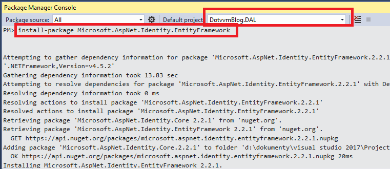
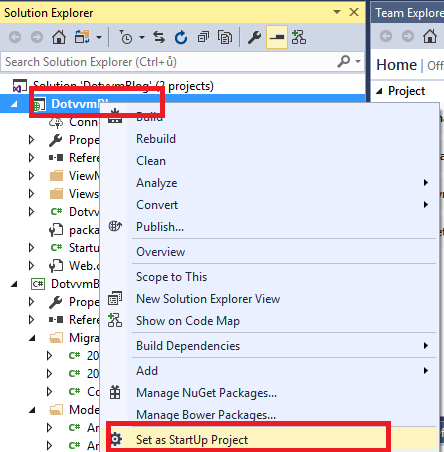
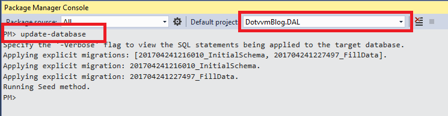
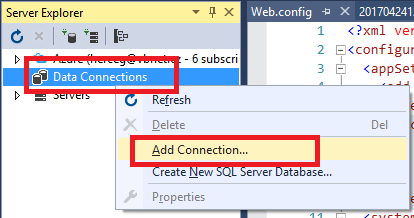
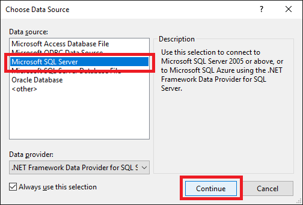
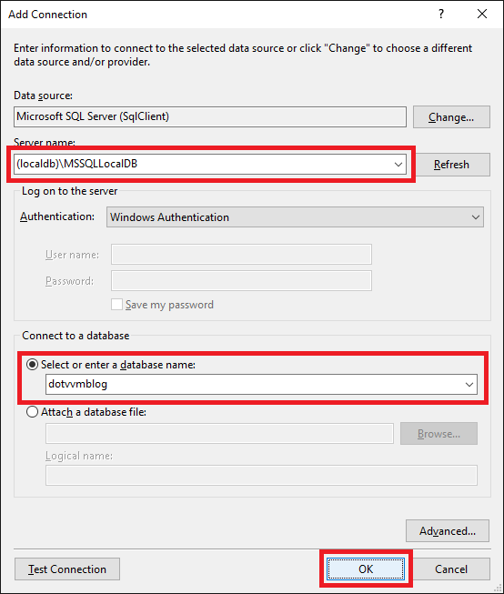
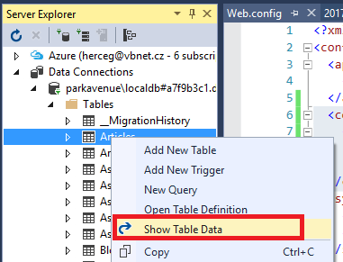

## 2 Database

To be able to focus on playing with DotVVM, we are going to use the Entity Framework Code First model from our sample project to create a SQL database for our application. The project also defines a function which seeds the database with some sample data. 

### 2.1 Data Access Layer

> Right click the solution in the *Solution Explorer* window and choose *Add > New Project*. Select the *Windows Classic Desktop > Class Library* project type and name it `DotvvmBlog.DAL`.

This project will contain the Entity Framework Code First model for our database.

We are going to use the ASP.NET Identity library to store user accounts and passwords. This library will add several tables to our model to store the users, roles and other data. 

> Copy the `sample\DotvvmBlog.DAL` from the [sample project](https://github.com/riganti/dotvvm-hands-on-lab) and copy it over the `DotvvmBlog.DAL` in your solution - just overwrite the entire folder of the project we have just created with the folder from the sample project. 

### 2.2 Install NuGet Packages

> In the *Package Manager Console* window, set the `DotvvmBlog.DAL` project as the *Default project*. 

> Run the `Install-Package Microsoft.AspNet.Identity.EntityFramework` in the console.



The ASP.NET Identity Entity Framework package depends on the Entity Framework package, so the `EntityFramework` package will be installed too.

### 2.3 Configure the SQL Server LocalDB

Before we create the database, let's make sure that the *SQL Server LocalDB* is running. This version of SQL Server is installed as part of the Visual Studio.

> In the *Start Menu*, type the `SQLLocalDB` in the search box, and run the script.  

A console window should appear for a second. It has started the `(localdb)\MSSQLLocalDB` instance of the SQL Server.

The Entity Framework model is set up to use the connection string named `DB` that is listed in the application config file.

> Open the `web.config` file in the DotVVM project.

> Add the following code inside the `<configuration>` section. If there is an element `<configSections>`, paste the code below it, not above it. The `<configSections>` element must be the first element.

```
  <connectionStrings>
    <add name="DB" 
         connectionString="Data Source=(localdb)\MSSQLLocalDB; Initial Catalog=dotvvmblog; Integrated Security=true"
         providerName="System.Data.SqlClient"/>
  </connectionStrings>
```

> Make sure that the`DotvvmBlog` project node in the *Solution Explorer* is listed in bold (that means it is a startup project). If not, right-click the project and choose *Set as Startup Project*.



> In the *Package Manager Console* window, run the `Update-Database`. Make sure that the _Default Project_ is `DotvvmBlog.DAL`, the project which contains the Entity Framework model.

This command should create the database and seed it with data. 



### 2.4 Connect to Database

To make sure the database has been created, let's try to connect to it.

> In the *View* menu, select the *Server Explorer* menu item. 

> Right-click the *Data Connections* icon and choose *Add Connection*.



> Select the *Microsoft SQL Server* as the connection provider.



> In the following window, type `(localdb)\MSSQLLocalDB` in the Data Source field and select `dotvvmblog` as a database.



> Now expand the *Tables* node in the `dotvvmblog` database and choose the *Show Table Data* item from the context menu of the first table.



You should see a list of articles.

[> Next Chapter](03.md)