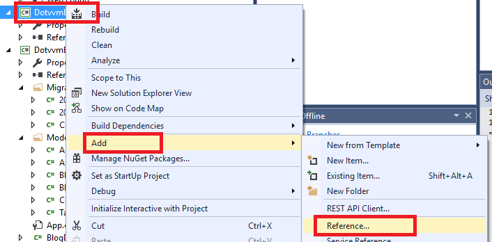
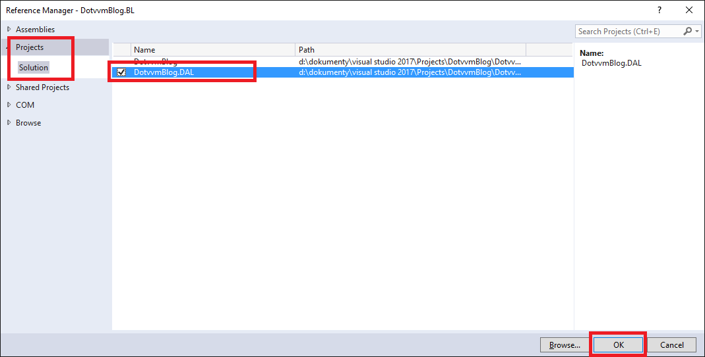

## 3. Business vrstva

Abychom se nezdržovali psaním kódu, který čte a ukládá data z databáze, připravili jsme ve [vzorovém projektu](https://github.com/riganti/dotvvm-hands-on-lab) projekt `DotvvmBlog.BL`, který obsahuje všechny funkce, které budeme na našem blogu potřebovat.

Je dobrým zvykem nepředávat do viewmodelů entity z Entity Frameworku. Do UI by vždy měly vstupovat pouze takzvané DTO objekty, které splňují následující kritéria:

* _Jsou serializovatelné do JSONu_: aby DotVVM fungovalo, musí být viewmodel serializován do JSONu a zaslán na klienta. Jednou z podmínek je i to, aby zde nebyly cyklické reference, což entity typicky mívají.

* _Nemají závislosti na DbContext_: Entity Framework si drží seznam entit, sleduje na nich změny, nebo provádí lazy loading v případě, že přistoupíte na vlastnost odkazující se do jiné tabulky. 

* _Obsahují jen to, co by klient měl vidět_: není dobrý nápad do UI předávat objekt User, který by obsahoval například heslo uživatele (byť zahashované). DTO by mělo obsahovat jen ty informace, které UI skutečně potřebuje.

Z tohoto důvodu vzorový projekt obsahuje složku `DTO`, která obsahuje tzv. _Data Transfer Objekty_. Tyto objekty mají jen public properties, neobsahují žádnou logiku, a jsou šité na míru přímo našemu UI. Není výjimkou, že pro jednu databázovou entitu máme více DTO objektů. Naopak, je to žádoucí - pro každý "pohled" na entitu bychom měli mít specializovaný DTO.

Součástí je také složka `Services`, která již obsahuje všechny funkce, které budeme potřebovat. Je zde například `HomepageService`, která obsahuje metodu `GetRecentArticles`. Ta nám vrátí seznam posledních článků se všemi informacemi, které budeme potřebovat.

### 3.1 Založení projektu

> Přidejte do solution projekt typu *Windows Classic Desktop / Class Library* s názvem `DotvvmBlog.BL`.

> Okopírujte do něj složky `Services` a `DTO` ze [vzorovém projektu](https://github.com/riganti/dotvvm-hands-on-lab) ze složky `sample\DotvvmBlog.BL`.

> V okně *Package Manager Console* vyberte jako default project `DotvvmBlog.BL` a spusťte následující příkaz: `Install-Package Microsoft.AspNet.Identity.EntityFramework`.

> Dále pravým tlačítkem klikněte na projekt `DotvvmBlog.BL`, vyberte `Add / Reference` a přidejte referenci na projekt `DotvvmBlog.DAL`.



> Vyberte záložku *Project* a zaškrtněte projekt `DotvvmBlog.DAL`.



## 3.2 Přidání reference v DotVVM projektu

Aby DotVVM projekt mohl DAL a BL používat, je nutné ještě přidat poslední referenci.

> Pravým tlačítkem klikněte na projekt `DotvvmBlog` a přidejte referenci na projekt `DotvvmBlog.BL`.

> V *Package Manager Console* vyberte default projekt `DotvvmBlog` a doinstalujte následující balíčky: 
```
Install-Package Microsoft.AspNet.Identity.EntityFramework
```

Aby bylo možné projekt zkompilovat, musíme do business vrstvy přidat Nuget balíček `DotVVM.Core`. Tento balíček obsahuje několik atributů a rozhraní, které DotVVM využívá pro práci s daty. 

> Otevřete soubor `DotvvmBlog\packages.config` a podívejte se, v jaké verzi je v projektu nainstalován balíček `DotVVM.Core`.

> V okně *Package Manager Console* vyberte projekt `DotvvmBlog.BL` a spusťte příkaz `Install-Package DotVVM.Core -version XXX`. Za `XXX` dosaďte stejnou verzi, kterou jste našli v `packages.config`.

> Pro jistotu ještě ověřte, že všechny projekty používají stejnou verzi .NET Frameworku (např. 4.5.2). V každém projektu stačí kliknout dvakrát na položku *Properties*.

> Zkuste projekt zkompilovat (menu *Project / Build*), jestli neobsahuje chyby.

[> Další kapitola](04.md)