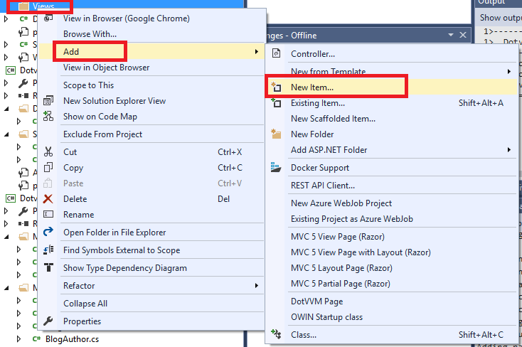

## 4 Home Page

Now we are ready to start with the web application itself.

### 4.1 Adding Bootstrap

We will use the popular [Bootstrap](https://getbootstrap.com) CSS framework to style our website.

> In the *Package Manager Console* window, choose `DotvvmBlog` as the default project and run `Install-Package bootstrap`.

The Bootstrap package added a few folders in the project:

* `Content` contains the CSS styles. 

* `fonts` contains the _glyphicons_ font. This font can be used to render various symbols. 

* `Scripts` contains the JavaScript part of Bootstrap, and also the jQuery library that is required by Bootstrap.

### 4.2 Using Bootstrap

There are two ways how to work with styles and scripts in DotVVM.

The first way is the same as in any other web technology. We can simply add the `<script src=...>` and `<link rel=stylesheet ...>` in the page.

The second way is to use the DotVVM resource system. It has some nice features, for example you can load the scripts from a CDN (Content Delivery Network) with an optional alternative sources which are used when the CDN is not available. The DotVVM resource system can also create script bundles and handles script dependencies so they are rendered in the correct order.  

We recommend to use the DotVVM resource system for scripts and styles that doesn't need to be used on all pages, or for those which have some dependencies on other scripts.

To show how the DotVVM resource system works, we'll use it to work with Bootstrap.

> Open the `DotvvmStartup.cs` file and add the following code in the `ConfigureResources`method:

```
    config.Resources.Register("bootstrap", new StylesheetResource()
    {
        Location = new UrlResourceLocation("/Content/bootstrap.min.css"),
        Dependencies = new[] { "bootstrap-js" }
    });
    config.Resources.Register("bootstrap-js", new ScriptResource()
    {
        Location = new UrlResourceLocation("/Scripts/bootstrap.min.js"),
        Dependencies = new[] { "jquery" }
    });
```

> You will also need to add `using DotVVM.Framework.ResourceManagement;`.

The code registered a new resource named `bootstrap`. It is a stylesheet (we have used the `StylesheetResource` class) and we have specified the location of the script. 

Additionally, we have told DotVVM that `bootstrap` depends on a resource named `bootstrap-js` which is another `ScriptResource` we have registered and which depends on `jquery`.

DotVVM already registers the `jquery` resource and uses the version 2.1.1 by default. 

With this settings, you can request the `bootstrap` resource anywhere in the app. For example, you can add `<dot:RequiredResource Name="bootstrap" />` in the page. DotVVM will load the Bootstrap CSS file and also the Bootstrap JavaScript file, which will be added after the jQuery script. DotVVM adds jQuery automatically in the _debug_ mode to make its diagnostic features work. In the production environment, the jQuery is not added to the page unless you request it explicitly.

> Add the following code in the `ConfigureResources` method:

```
    config.Resources.Register("site", new StylesheetResource()
    {
        Location = new UrlResourceLocation("/Content/site.css"),
        Dependencies = new[] { "bootstrap" }
    });
```

It adds the `Content/site.css` and specifies a dependency on `bootstrap`. We will need to override some Bootstrap CSS classes so we need to include this file in the page after the Bootstrap CSS.

> Copy the `site.css` from the [sample project](https://github.com/riganti/dotvvm-hands-on-lab) from the  `sample\DotvvmBlog\Content` folder in the `Content` folder in your project.

Now we need to request the `site` resource in the application which should add everything we will need.

### 4.3 Creating the Master Page

In the `Default.dothtml`, you can see the `head` and `body` elements. Most web apps have a common header, menu and footer and only the main page content differs. 

DotVVM solves this with a feature called _Master Pages_.

> First, delete the `Default.dothtml` and `DefaultViewModel.cs` files.

> Right-click the `Views` folder and choose *Add > New Item*.



> In the New Item dialog, select the *DotVVM Master Page* from the *DotVVM* category. Set the Name to `Site`.


> Confirm the next dialog window to create a master page with a corresponding viewmodel.


Visual Studio should create the `Views\Site.dotmaster` and `ViewModels\SiteViewModel.cs` files. 


### 4.4 Layout

> Open the `Site.dotmaster` file and replace its contents with the following code:

```
@viewModel DotvvmBlog.ViewModels.SiteViewModel, DotvvmBlog

<!DOCTYPE html>

<html lang="en" xmlns="http://www.w3.org/1999/xhtml">
<head>
    <meta charset="utf-8" />
    <title>{{value: PageTitle}}</title>
</head>
<body>

    <div class="container-fluid part-login">
        <!-- admin section link, login button -->
    </div>

    <div class="container part-content">

        <dot:ContentPlaceHolder ID="MainContent" />

    </div>

    <div class="container-fluid part-footer">
        Powered by <a href="https://www.dotvvm.com" target="_blank">DotVVM</a>
    </div>

    <dot:RequiredResource Name="site" />

</body>
</html>
```

We have just done several things:

1. In the `title` element, we write the `PageTitle` property from the viewmodel. It is a good idea to set an appropriate title in all pages.

2. There are three sections in the page - header, content and footer.

3. At the end of the page, we have requested the `site` resource which we configured in the `DotvvmStartup` file. DotVVM adds the `script` and `link` elements in a correct order. 

It does not matter where the `dot:RequiredResource` control is located. DotVVM always adds the styles in the `head` section and the scripts at the end of the `body` section. 

Notice that the second section contains a control called `dot:ContentPlaceHolder`. This control defines a place where the specific page can render content. We will explain how this works in a while.

> Look in the `ViewModels\SiteViewModel.cs` file.

The `SiteViewModel` class is a viewmodel for the master page. The viewmodel of all pages which use this master page, must inherit from the `SiteViewModel`. 

> Make the `SiteViewModel` abstract and add the following property in the page:

```
    public abstract class SiteViewModel : DotvvmViewModelBase
    {

        public abstract string PageTitle { get; }

    }
```

Now all pages that derive from the `SiteViewModel` will have to implement the `PageTitle` property.

### 4.5 Home Page

Finally, we can create the home page.

> Right-click the `Views` folder and choose *Add > New Item* in the context menu.

> Select the *DotVVM Page* template and set the Name to `Default`:


> In the next dialog window, check the *Embed in Master Page* option and select the `Site.dotmaster`:


Visual Studio will create the `Views\Default.dothtml` file with a corresponding viewmodel `ViewModels\DefaultViewModel.cs`.

> Open the `ViewModels\DefaultViewModel.cs` file and change its base class to `SiteViewModel`.

If you look in the `Default.dothtml` file, you can see the `@masterPage Views/Site.dotmaster` directive. This tells DotVVM that the page should be embedded in the `Site.dotmaster` master page.

Notice that this page doesn't contain the `head` and `body` elements, but there is the `dot:Content` control instead. Everything you place inside this control, will be placed in the `dot:ContentPlaceHolder` control in the master page. 

You can have multiple `ContentPlaceHolder` controls in the master page. In that case, the content pages should have the same number of the `Content` controls. Notice that the `ContentPlaceHolderID` property of the `Content` control contains an `ID` of the corresponding `ContentPlaceHolder` control ins the master page. 

> In the `Default.dothtml` file, add the following code in the `dot:Content` control:

```
    <div class="jumbotron">
        <h1>DotVVM Blog</h1>
        <h2>Recent Articles</h2>
    </div>
```

> Now open the `ViewModels\DefaultViewModel.cs` file and implement the `PageTitle` property:

```
    public override string PageTitle => "DotVVM Blog";
```

> Launch the website by pressing the *F5* key. You should see a page with a header and footer that are declared in the master page, and  the *DotVVM Blog* and *Recent Articles* headings which we have added in the `Default.dothtml`.

[> Next Chapter](05.md)