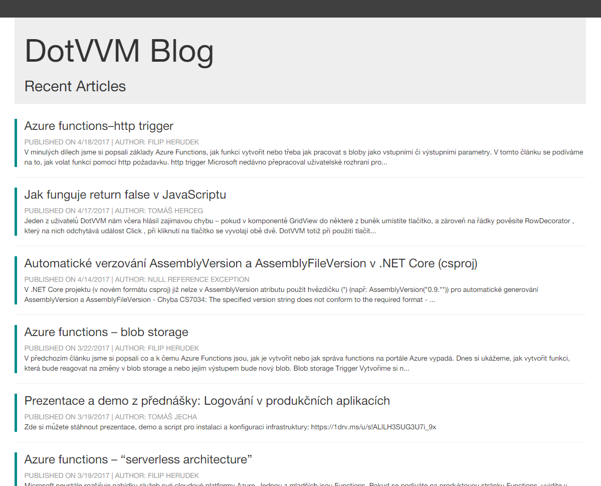

## 5 List of Articles

Now let's render a list of recent articles in the home page. 

In the previous chapter, we mentioned that everything that changes in the page, must be represented in the viewmodel. So let's add a collection of articles in the viewmodel. 

### 5.1 Loadin Data

> Open the `ViewModels\DefaultViewModel.cs` file and add the following property:

```
public List<ArticleListDTO> RecentArticles { get; private set; }
```

> You'll need to add the following `using` directive:

```
using DotvvmBlog.BL.DTO;
```

We'll need to add the articles in the `RecentArticles` collection to be able to display them in the page.

Notice that the `DefaultViewModel` class inherits from the `SiteViewModel` which inherits from the `DotvvmViewModelBase` class.

In DotVVM, any object can be the viewmodel. However, it is recommended to inherit from the `DotvvmViewModelBase` class. This class defines several events which you may need to extend. These events are invoked in various stages of the HTTP request processiong. We will talk about the events in more detail later.

For now, we will override the `PreRender` method. This method is used to load the data from the database. 

> Add the following code in the `DefaultViewModel` class:

```
    public override Task PreRender()
    {
        var service = new HomepageService();
        RecentArticles = service.GetRecentArticles();

        return base.PreRender();
    }
```

> We'll need to add the following `using`:

```
using DotvvmBlog.BL.Services;
using System.Threading.Tasks;
```

In the `PreRender` method, we have instantiated the `HomepageService` class from the business layer and e have loaded the `RecentArticles` collection with the data returned by the `service.GetRecentArticles()` method.
This method uses the Entity Framework to get recent articles and returns a collection of the `ArticleListDTO` objects. These objects contain all properties we will need in the page.

### 5.2 Displaying the Articles

The viewmodel is ready and now we can create the page.

DotVVM includes the `dot:Repeater` control which can render a piece of HTML for each item in a given collection.

The data-binding in DotVVM works in both ways. Therefore, if you add an item in the collection, the control will notice that and render an additional item immediately.

> Open the `Default.dothtml` page and add the following code after the headings:

```
    <dot:Repeater DataSource="{value: RecentArticles}">
        <div class="box-article">
            <h3>{{value: Title}}</h3>
            
            <div class="article-metadata">
                Published on <dot:Literal Text="{value: PublishedDate}" FormatString="d" />
                |
                Author: {{value: AuthorName}}
            </div>

            <p>{{value: Abstract}}</p>
        </div>
        <hr />
    </dot:Repeater>
```

The `Repeater` control has the `DataSource` property bound to the `RecentArticles` collection in the viewmodel. 

For each article, the `Repeater` control will render its contents. The data-binding expresions inside the `Repeater` are evaluated on the particular `ArticleListDTO` object. 

Ntoice that the `PublishedDate` property is `DateTime`. We'd like to display it in a human readable format, that's why we use the `Literal` control with the `FormatString` property set to `d` which means short date. 

DotVVM uses the same format string syntax as you know from the .NET Framework. You can use also the custom format specifiers, like `d/M/yyyy`.

> Run the app by pressing the *F5* key to see a list of articles.



[> Next Chapter](06.md)