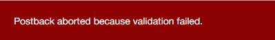

## 8 Validace

Jednu z věcí, kterou jsme ještě neřešili, je validace. Aktuálně totiž uživatel může přidat prázdný komentář.

DotVVM umí pro validaci využívat Data Annotations atributy, které jsou součástí .NET Frameworku.

> Otevřete třídu `NewCommentDTO` a vlastnost `Text` odekorujte následujícím atributem:

```
    [Required]
    public string Text { get; set; }
```

Každý postback v DotVVM standardně validuje celý viewmodel a pokud některá vlastnost není validní, postback se neprovede. Nyní by tedy uživatel nebyl schopen prázdný komentář odeslat.

V reálné aplikaci často celý viewmodel validovat nechceme. Validaci je možné pro konkrétní tlačítko (nebo část stránky) vypnout pomocí vlastnosti `Validation.Enabled="false"`. 

Kromě toho můžete pomocí vlastnosti `Validation.Target="{value: NewComment}"` říci, že nechcete validovat celý viewmodel stránky, ale jen jeho část (v tomto případě objekt `NewComment`). V tomto případě se musí jednat o objekt, jako target nelze použít primitivní datové typy jako `string` nebo `int`.

### 8.1 ValidationSummary

Díky atributu `Required`, který jsme přidali, nebude uživatel moci přidat prázdný komentář. Aby však viděl, proč tlačítko nic neudělalo, musíme do stránky přidat komponenty, které zobrazí validační chyby. 

Nejjednodušší je použít komponentu `ValidationSummary`. Ta zobrazí seznam všech validačních chyb ve svém `Validation.Target`. Pozor, komponenta `ValidationSummary` zobrazuje validační chyby z primitivních vlastností ve validation targetu, ale už ne z objektů, které jsou v něm obsažené. V případě složitější hierarchie objektů by byl výpis chyb nepřehledný.

Pokud byste chtěli validovat target včetně objektů, které jsou v něm vnořené, lze to změnit vlastností `IncludeErrorsFromChildren`. 

> V souboru `Views\ArticleDetail.dothtml` přidejte před `div` obsahující tlačítko `Post Comment` následující blok:

```
    <div class="form-group validation">
        <dot:ValidationSummary Validation.Target="{value: _this}" />
    </div>
```

> Spusťte aplikaci a zkuste přidat prázdný komentář. Měla by se objevit chybová hláška.

Kromě toho se v rohu obrazovky objeví následující hláška. Ta se objevuje pouze v _debug_ režimu, aby si vývojář uvědomil, že postback se neprovádí kvůli validaci. Pokud byste totiž do stránky žádnou validační komponentu nedali, tlačítko by nic neudělalo a nemuselo by vás napadnout, že je to kvůli validaci.



Pokud aplikaci zkompilujete v _release_ módu, hláška se neobjeví. Řídí se to nastavením `configuration.Debug` v souboru `Startup.cs`.

### 8.2 Validator

Občas můžeme chtít zobrazit chybovou hlášku hned vedle příslušného políčka. Můžeme použít komponentu `Validator`:

```
<dot:Validator Value="{value: Text}" class="validation" />
```

Chybová hláška se zobrazí v případě, že je vlastnost `Text` nevalidní. Komponenta `Validator` má ještě další nastavení, a nemusíte ji používat jako komponentu.

Pokud bychom chtěli například elementu `div`, uvnitř kterého je náš `TextBox`, nastavit nějakou CSS třídu v případě, že je vlastnost `Text` nevalidní, udělali bychom to takto:

```
    <div class="form-group">
        <div Validator.Value="{value: Text}" Validator.InvalidCssClass="has-error">
            <dot:TextBox Text="{value: Text}" Type="MultiLine"
                            class="form-control" style="height: 140px" />
        </div>
    </div>
```

Vlastnost `Validator.Value` říká, která vlastnost se má kontrolovat, a `Validator.InvalidCssClass` říká CSS třídu, která se má přidat v případě, že je vlastnost nevalidní. V případě Bootstrapu používáme CSS třídu `has-error`, která pole uvnitř elementu s touto CSS třídou, orámuje červeně.

Vlastnost `Validator.InvalidCssClass` nemusíte nastavovat u každého takového `div`u - stačí ji nastavit na libovolném nadřazeném elementu, klidně třeba na elementu `body` v master page.

> Upravte `div` s textovým polem pro zadání formuláře ve stránce `ArticleDetail.dothtml` takto:

```
    <div class="form-group">
        <div Validator.Value="{value: Text}">
            <dot:TextBox Text="{value: Text}" Type="MultiLine"
                            class="form-control" style="height: 140px" />
        </div>
    </div>
```

> V souboru `Site.dotmaster` nastavte elementu `body` vlastnost `Validator.InvalidCssClass`:

```
<body Validator.InvalidCssClass="has-error">
```

Nyní stačí kdekoliv v aplikaci libovolnému elementu nastavit `Validator.Value` a DotVVM mu přidá nebo odebere CSS třídu `has-error` podle toho, zda je daná vlastnost validní. 

[> Další kapitola](09.md)